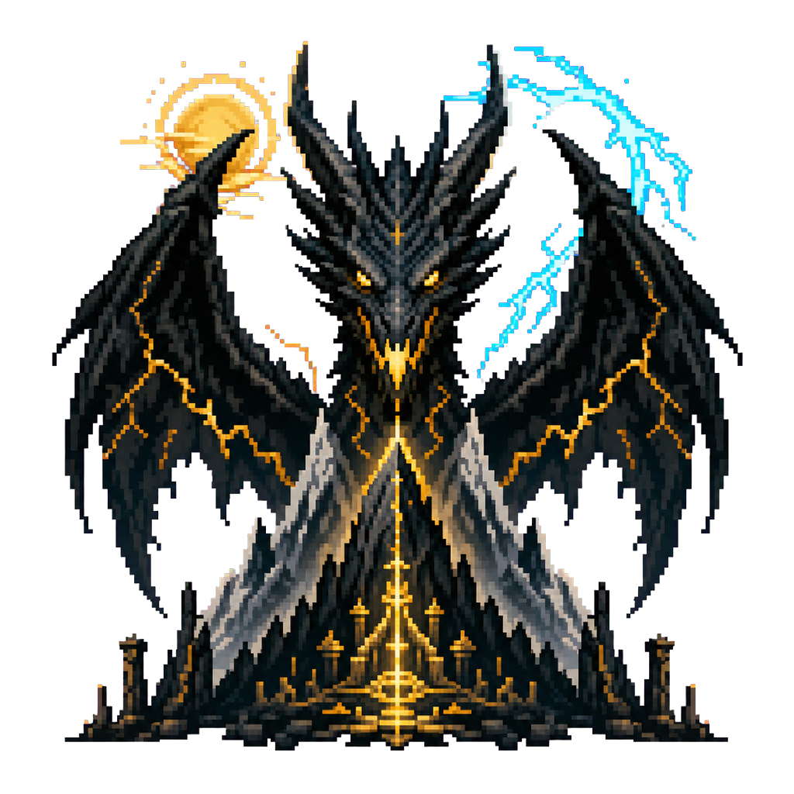
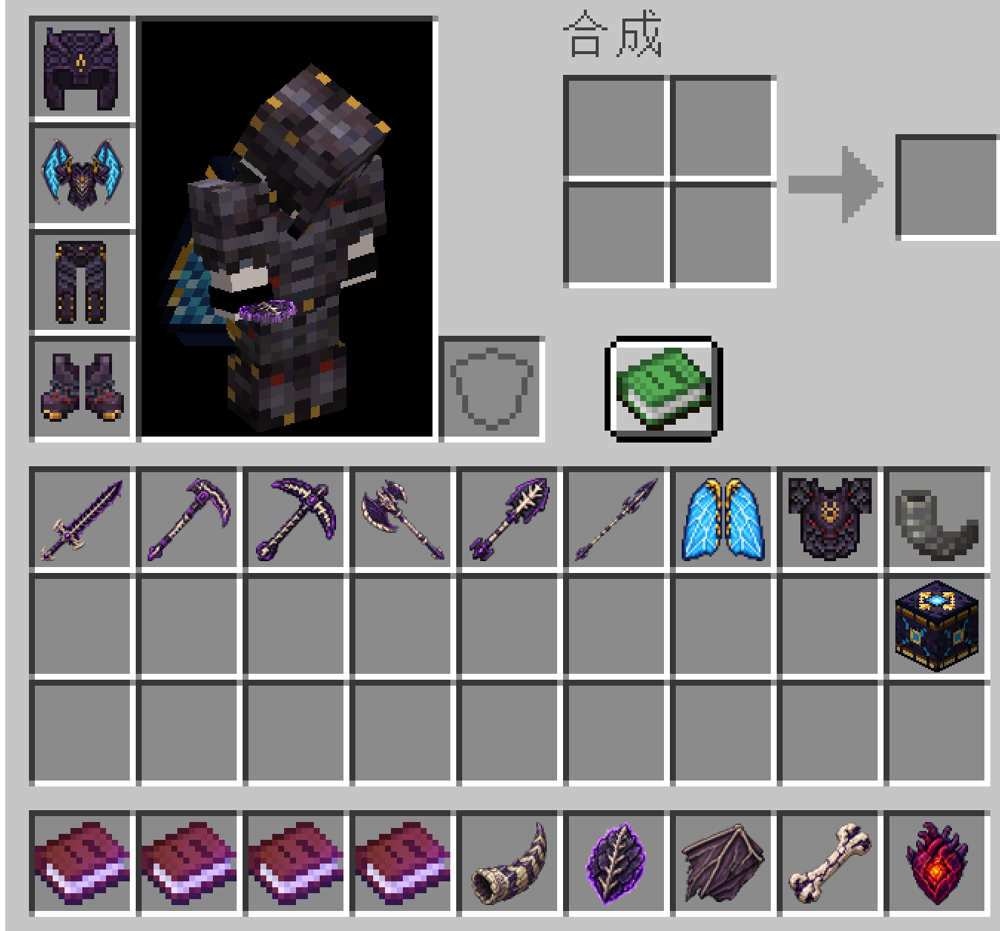

# Ancient Dragon



**English** | [中文说明](#中文说明)

> Public alpha for Minecraft `26.1.2`. Back up important worlds before installing or upgrading.

Ancient Dragon is a Fabric boss mod built around one world-unique encounter. A colossal dragon
sleeps on a sacred mountain selected in a distant deep ocean. Players can discover the mountain,
open an Ancient City gateway, fight the dragon across aerial and ground phases, and harvest its
corpse for shared progression rewards.

### Screenshots


*The sacred mountain sanctum and its dormant guardian.*


*The Ancient Dragon at full scale during the storm phase.*



*Armor, tools, weapons, wings, materials, and the Sunheart Altar.*

### Highlights

- A deterministic 768×768 sacred mountain generated once per Overworld.
- Server-authoritative flight, multipart hitboxes, threat selection, wing stability, and scalable
  multiplayer combat.
- Mountain, storm, and solar phases with aerial attacks, platform combat, and persistent state.
- A complete encounter lifecycle: dormant dragon, awakening, battle, death, corpse, harvesting,
  chronicles, advancements, materials, equipment, and Sunheart Altar upgrades.
- Ancient City gateways lead to the same unique mountain without creating duplicate encounters.

### Requirements and installation

- Minecraft `26.1.2`
- Fabric Loader `0.19.3` or newer
- Java `25` or newer
- Fabric API `0.154.2+26.1.2`
- [BlendLib `1.0.0-alpha.1+26.1.2`](https://github.com/LIy-hub/BlendLib-Public/releases/tag/v1.0.0-alpha.1%2B26.1.2)
  or a newer compatible release
- Ancient Dragon must be installed on both the server and every connecting client.

Install Fabric Loader, then place Fabric API, BlendLib, and the Ancient Dragon JAR in the `mods`
folder. Natural mountain generation only affects previously ungenerated chunks. Use
`/ancientdragon structure locate` as an operator to inspect the selected location.

### License and redistribution

Code is available under the [MIT License](LICENSE). Project media and adapted dragon assets are
available under [CC BY 4.0](ASSET_LICENSE.md). Modpacks, server client-packs, videos, streams, and
commercial platform monetization are allowed when the applicable license and attribution notices
are preserved. See [third-party attribution](THIRD_PARTY_NOTICES.md) and the
[changelog](CHANGELOG.md).

## 中文说明

这是“主世界神山苏醒、群山与风暴加太阳、单次击杀后留下可挖掘尸骸”的古龙 Boss 项目。
当前版本已经从纯模型竖切进入第一段可玩 Boss 竖切：真实 v011 高模、骨骼动画、
Fabric 实体、BlendLib 语义动画与服务器权威战斗状态机已经连成一条链。

## 当前已完成

- Minecraft `26.1.2` / Fabric Loader `0.19.3` / Fabric API `0.154.2+26.1.2`。
- [BlendLib `1.0.0-alpha.1+26.1.2`](https://github.com/LIy-hub/BlendLib-Public/releases/tag/v1.0.0-alpha.1%2B26.1.2)
  必需依赖；Gradle 会从固定的公开 GitHub Release 下载并校验运行库。
- 10 个蒙皮网格、100 个导出节点、28 个基础动作、4 张外置 Base Color PNG。
- 从同一 GLB 骨架离线烘焙的格式 v2、逐 tick 局部 TRS 碰撞资源：服务端执行完整 FK，头、
  三段躯干、腿、主/副翼和五段尾部共 24 个网络碰撞箱都跟随完整姿态与程序骨骼。
- 头部受击伤害最高；俯冲、风暴与太阳吐息从头部骨骼代理发出，扫尾从尾尖代理发出。
- 服务端权威三维四元数飞控支持航向、分状态俯仰包络、普通转弯不超过 35° 的前馈侧倾、倒飞、
  60 tick 桶滚与 72 tick 环形机动；普通姿态每 tick 最多变化 3°，实体移动始终沿当前模型前向。
- 明确转弯时，曲率会主要在 pelvis→spine→chest 累积到约 28–64°；向下扑击时腹部与主干
  形成约 16–56° 的纵向弧线。八段尾巴反向拖曳到约 130–150°，并使用逐节阻尼弹簧；
  尾根快速受控，尾尖响应延迟约 0.65 秒且会有限回弹，翼和腿也按受力产生较小的不对称响应。
- 头颈注意力按攻击焦点、最近攻击者、最高威胁、144 格可见观察者、地面扫视排序，总水平活动
  范围为左右各 135°、向下 110°、向上 80°；无目标时头部保持低下并缓慢扫视地面。眼睛先动、
  头部跟随、四段颈部由头端向基部延迟，并在长期回望时请求身体补转。
  身体补转采用 75° 启动、55° 退出的迟滞，并转换为最多 ±12° 的绝对路径偏置，不再积累；
  攻击朝向使用独立的受限输入，不会因玩家长期位于侧后方而产生航向积分堆积和左右摇摆。
- 四元数、躯干/尾部曲率、注意力角度/模式/目标与机动状态全部通过原版 `SynchedEntityData`
  同步；客户端 slerp/lerp，不使用自定义网络协议。完整姿态和速度写入 NBT，重载时不恢复半途机动。
- 每个碰撞部位按完整骨骼旋转投影为保守世界 AABB；`F3+B` 白框不再二次插值，侧翻和倒飞时
  水平/垂直覆盖会随姿态交换或扩展。
- 沉睡、死亡和尸骸关闭程序姿态；咬击保护作者头颈动作，扫尾保护作者尾部动作，吐息继续
  使用服务器攻击焦点和解算后的头骨方向。
- 在此前巨型比例上整体放大 1.6 倍（10 倍版本的 16%，descriptor
  `units_per_block = 0.0625`）；模型、24 个动态碰撞部位、主体占位、阴影和头部
  攻击起点使用同一倍率，飞行速度、伤害及注意力距离保持不变。觉醒后不再创建持续世界迷雾。
- 沉睡、玩家在 28 格内接近/攻击唤醒、9.05 秒苏醒、4.05 秒起飞、约 Y=200 的低空巡航、
  双空中攻击、白色平台陆战、山峰驻足和再次起飞构成完整循环；空中目标与实际位移均限制在
  标记的绿色飞行区域内，平台陆战窗口随群山/风暴/太阳阶段为 25/22/18 秒。
- 空中使用俯冲、逐骨骼扫尾、风暴爆发和被地形截断的太阳吐息；地面使用真实
  `Bite_Heavy`、`Wing_Slam` 和 `Solar_Breath` 动画碰撞。
- 1–8 人生命锁定为 `600 + 180 × 额外人数`，战斗中只会上调不下调；当前活跃人数只影响压力、
  冷却和有限伤害倍率。全员离开真实结构裁切战区 30 秒后才返回沉睡点。
- 目标选择拆分为终生贡献和约 20 秒近期仇恨，头部命中与山峰引导打断增加近期仇恨；目标至少
  锁定 5 秒。攻击由集群、距离、背后目标、可见性和反重复惩罚确定性评分，不再使用固定轮播。
- 空中和驻足时显示第二条翼部稳定性 Boss 条；翼根/中段/翼尖使用独立的稳定性权重，归零后
  完成当前动作、播放受创动画并强制返回白色战斗平台，一轮空战最多触发一次。
- 正式放置与世界唯一遭遇记录绑定为 `DORMANT → ACTIVE → DYING → CORPSE`。空中死亡会在最多
  8 秒内受控返回白色战斗平台，播放完整 12.05 秒死亡动作；尸骸受重力影响会落到地面，完成战利品
  分配后以灰烬和灵魂火缓缓消散 10 秒，世界唯一击杀记录仍然保留。
- 主世界会按种子从 4,224～8,064 格探索带中确定唯一的深海神山候选；冻结神山按区块随世界生成，
  龙眠区块首次加载后生成或接管唯一古龙，并把自然 placementId 与龙 UUID 写入世界遭遇记录。
- 尸骸不再区分采集部位：任意斧头对任意尸体碰撞箱使用一次，即按参战人数把龙角、鳞片、翼膜和
  龙骨的个人份额直接放入每位合格玩家背包，唯一龙心交给操作者；离线份额会先迁入世界持久化队列，
  即使尸骸消散也会在玩家回归时发放。击杀后前 10 分钟只允许合格参战者操作。合格玩家同时获得“群山归寂”挑战和经验，调试战不写入正式记录或奖励。
- 所有古龙材料、日轮心坛、苍穹之翼、岳铸龙鳞甲与烬骨工具集中在独立“古龙遗珍”创造物品栏；
  剑、斧、镐、锹、锄、长矛均可在日轮心坛用 10 根古龙遗骨淬炼，并用古龙遗骨修理。
- 双 Boss 条、阶段名称、战斗/尸骸状态、参战数据、攻击导演历史和采集进度全部持久化，并提供
  命中箱、航线、导演评分、阶段、攻击和稳定性的管理员调试命令。
- 世界观不额外生成遗迹或谜题：门开启、古龙苏醒、首次被古龙击杀、以及古龙正式成为尸骸时，
  会分别发放四本可收藏的《余烬档案》。它们只记录旧世界遗民的故事，不改变开门条件、Boss 数值、
  掉落或锻造配方。
- 神山的每一处已加载区域都有高密度、仅本地可见的“下界遗响”：顶峰保留灵魂沙峡谷的灵魂与
  白灰粒子，外缘是下界荒地的余烬，两侧分别过渡到绯红林与诡异林，山心则为玄武岩三角洲。64 类适合环境
  表达的原版粒子会按区域、高度和稀有度轮换，形成神性而非杂乱的视觉场；心形、伤害、爆炸、
  药水状态等会误导战斗判读的粒子不会被用于环境。

## 构建

构建不依赖作者电脑上的 `D:\BlendLib`。Gradle 会从 BlendLib-Public 的固定 Release 下载
运行库、核对 SHA-256，并从中提取编译所需的 API/Common facade。然后执行：

```powershell
$env:JAVA_HOME='C:\Program Files\Java\latest\jdk-25'
cd D:\AncientDragon
.\gradlew.bat --no-daemon --max-workers=1 clean check build --console=plain
```

输出模组：

```text
D:\AncientDragon\build\libs\ancient-dragon-0.1.0-alpha.1.jar
```

运行时还必须安装同版本
[BlendLib Fabric JAR](https://github.com/LIy-hub/BlendLib-Public/releases/download/v1.0.0-alpha.1%2B26.1.2/blendlib-fabric-1.0.0-alpha.1%2B26.1.2.jar)。

## 本地观察模型

```powershell
cd D:\AncientDragon
.\gradlew.bat runClient
```

进入一个允许命令的测试世界后依次执行：

```text
/ancientdragon spawn
/ancientdragon awaken
/ancientdragon status
/ancientdragon animation idle
/ancientdragon animation cruise
/ancientdragon animation bite
/ancientdragon animation death
/ancientdragon maneuver roll_left
/ancientdragon maneuver roll_right
/ancientdragon maneuver loop
/ancientdragon maneuver evade_left
/ancientdragon maneuver evade_right
/ancientdragon maneuver pull_up
/ancientdragon maneuver cancel
/ancientdragon attention nearest
/ancientdragon attention scan
/ancientdragon attention clear
/ancientdragon combat status
/ancientdragon combat start
/ancientdragon combat phase <mountain|storm|solar>
/ancientdragon combat attack <dive|tail|storm|solar|bite|wing>
/ancientdragon combat stability get
/ancientdragon combat stability set <0..310>
/ancientdragon combat stability break
/ancientdragon combat participants
/ancientdragon combat hitboxes <on|off>
/ancientdragon combat route <on|off>
/ancientdragon combat director <on|off>
/ancientdragon combat stop confirm
/ancientdragon mountain preview
/ancientdragon mountain preview 984221
/ancientdragon mountain preview clear
/ancientdragon mountain build
/ancientdragon mountain build 984221
/ancientdragon mountain status
/ancientdragon mountain pause
/ancientdragon mountain resume
/ancientdragon mountain reset <buildId> confirm
/ancientdragon mountain finalize
/ancientdragon structure preflight
/ancientdragon structure preflight 1
/ancientdragon structure locate
/ancientdragon structure status
/ancientdragon structure place <placementId> confirm
/ancientdragon structure pause
/ancientdragon structure resume
/ancientdragon structure discard <placementId> confirm
/ancientdragon structure repair-natural
/ancientdragon structure repair-natural status
/ancientdragon clear
/ancientdragon chronicle
```

`spawn` 会生成沉睡古龙。生存玩家进入 256 格或首次攻击会触发苏醒；也可用 `awaken` 强制开始。
动画命令仅用于视觉调试，可能暂时覆盖状态机当前动作。`status` 会显示状态、阶段、生命、
缩放人数、当前攻击、服务器目标、最近命中的部位、机动冷却和注意力角度/目标。自动行为不会
触发完整翻滚：远程攻击闪避改为最大约 45° 的有限侧闪，俯冲回收改为最大约 70° 的拉升，
普通巡航不再随机桶滚；完整 360° 桶滚和环形机动只通过管理员命令测试；
`attention clear` 会持续清除目标并朝前，`nearest` 或 `scan` 可切换到对应调试模式。

`/ancientdragon chronicle` 对所有玩家开放，仅重新领取自己已经解锁但遗失的《余烬档案》；它不会
解锁任何章节，也不会提供游戏奖励。其余列出的 `/ancientdragon` 调试和世界管理命令仍需要管理员权限。

### 主世界自然生成

每个主世界按世界种子生成一组确定性的远距离候选，并只选择其中第一个完整 48×48 区块占地、
以及四周额外 16 区块（256 格）缓冲带全部属于 `#minecraft:is_deep_ocean` 的位置；中心是深海但
任一方向靠近海岸或岛屿的候选都会被淘汰，因此最终只会有一座位于开阔海域的自然神山。
候选半径为 264～504 区块，
即约 4,224～8,064 格；它不是普通生物刷怪，也不会在玩家身边随机刷新。

```text
/ancientdragon structure locate
```

该命令直接返回这个世界的唯一深海候选。自然神山使用冻结的 `sacred_mountain_live_v1`，以
16×16 方块切片随新区块流式生成，不会一次性写入全部 3,064 万方块。完整的 48×48 区块占地
由 3×3 个结构起点分区承载，每个起点只负责 16×16 区块，因此不会触及原版只搜索 ±8 区块
结构引用的硬上限。自然生成会在低于海平面的既有山麓上续接一层不规则岩质岛基，使主要山体
露出水面；最外圈仍保留水下坡脚，峰顶高度与古龙飞行路线不变。空的外围切片保留原海床，
资源中明确记录的方块和洞穴空气才会覆盖原地形。方向由世界种子稳定选择，锚点固定在世界底部
以上三格，最高点保持在 `Y=249`。

自然生成只发生在尚未生成的区块。曾由旧版单一起点生成、地图上呈 17×17 区块方形截断的神山，
可由管理员执行 `/ancientdragon structure repair-natural`；修复任务逐切片恢复冻结方块、洞穴空气
和露水岛基，进度写入存档并可用 `repair-natural status` 查询，服务器重启后会继续。
该命令会覆盖旧版截断区内本不应存在的原版地形，因此只对检测到旧版大结构片的存档开放。
已经存在的正式手工遭遇记录优先，自然神山不会再创建第二条正式龙。原版 `/locate structure`
不认识本模组的自定义唯一 placement，请使用上面的专用命令。

### 远古城市登山之门

远古城市中央那座未启用的强化深板岩框架现在是前往神山的正式入口。手持一枚回响碎片，右键
框架上的任意强化深板岩；系统只接受原版中心模板的 55 方块缺口版或实际生成时可能出现的
56 方块完整顶边版，并要求内部
20×6 的空间没有被其他方块占用。激活前会先生成或读取这个世界唯一的自然神山，验证登山路线
第一个海面以上节点的脚下支撑和两格净空；任何一步失败都不会消耗碎片，也不会修改框架。

成功后框架内会形成幽匿传送面，消耗一枚回响碎片（创造模式不消耗）。玩家在门中停留约两秒，
会被送到神山登山路线入口并自动朝向上山方向。不同远古城市的完整框架都可独立激活，但全部通往
同一座唯一神山；当前为单向旅程，不在神山创建返程门，以免多座远古城市之间产生含糊的返回点。
旧存档若已经生成了神山候选区块却没有自然神山，激活会明确失败，仍不会吞掉回响碎片。

神山的任意已加载区域都会散发“下界遗响”，位于山体内的玩家附近仍会缓慢形成少量悬浮的不灭灵魂火。
灵魂火只占据贴近山体方块的空气格，不需要灵魂土支撑，不会因天气或方块更新自行熄灭。玩家位置会稳定
映射到五个下界记忆区：顶峰的灵魂沙峡谷、外围的下界荒地、两侧的绯红林/诡异林，以及山心的玄武岩三角洲；
这些记忆只决定粒子调色板，不会叠加任何自定义雾效，也不会改写原版生物群系或世界生成。每 4 tick 会在玩家周围本地生成 6～7 个、从
64 类安全环境粒子中按区域和稀有度选择的效果，只有位于神山范围内的玩家收到它们。这样可保留高密度的神性，
同时不会把未被观察的 768×768 区域持续广播给所有客户端，也不会用心形、伤害、爆炸或药水状态粒子伪造战斗信息。

### 神山大地形 v3 作者底模

神山工具只用于独立的低位超平坦美术世界。v3 使用固定的 768×768 连续断层山脊图：西南弯曲
谷底路线穿过双壁峡谷和风蚀拱，随后进入破碎冠峰；北侧风暴峰是一条倾斜三齿刃脊，南侧太阳峰
是一条从主山体伸出的长脊，六条低位支脉把峰群接回山脚。东侧龙巢是从崖壁切出的不规则台地，
不再叠加圆柱山基、径向尖帽、环形峭壁或圆形盆地。seed 只改变 2～6 格表面侵蚀和材料斑块，
不会移动路线、刃脊节点、龙巢或向东起飞方向。

正式生成必须先审阅同 seed 的 1:4 彩色预览：

```text
/ancientdragon mountain preview 984221
/ancientdragon mountain status
/ancientdragon mountain preview clear
/ancientdragon mountain build 984221
```

预览约 192 格宽；灰色为山体、浅灰为陡壁、青色为登山路线、红色为动画净空、黄色为龙锚点和
向东起飞方向。只有完整预览执行 `preview clear` 后才会批准对应 `(shapeVersion, seed)`；v2 预览
不能批准 v3 正式底模。未完成的预览可以清除，但不会解锁正式底模。

### 已提取神山的正式世界落地

完成精修的神山已冻结为 `sacred_mountain_live_v1`：本地范围为 `768×310×768`，包含
`30,640,378` 个非空气方块和 1,372 个非空 16×16 切片。结构资源保留洞穴空气和材料；三座峰顶
不再放置附魔台，也不包含方块实体索引。资源在读取时逐切片校验 SHA-256，整结构哈希固定为
`99964e3f77f39518bffc244d9f55a888346e6ab7c41acca66e217756aa9c4294`。

正式放置必须站在目标超平坦区域内先执行只读预检。命令会把玩家所在区块的西北角作为水平锚点，
把该点的地表方块作为 `Y=0` 支撑面；参数 `0`～`3` 分别表示顺时针旋转 0°、90°、180°、270°：

```text
/ancientdragon structure preflight [quarter_turns]
/ancientdragon structure status
```

预检会检查完整山基支撑、全部实心体素冲突、洞穴空气冲突、世界高度和资源哈希，不会修改任何方块。
只有状态变成 `ready` 后，才能使用状态中返回的唯一 placementId 二次确认：

```text
/ancientdragon structure place <placementId> confirm
```

放置按切片执行，每 tick 预算约 30 ms；进度、锚点、旋转、裁切框、龙休眠点和当前游标保存在世界
数据中。运行中可 `pause`，服务器重启后任务会安全停在 `paused`，必须显式 `resume`。尚未开始写入
的预检可用 `discard <placementId> confirm` 丢弃；一旦进入正式放置阶段便禁止自动清除。结构完成后
会在旋转后的休眠点自动生成一只沉睡古龙，并把龙 UUID 写回清单，防止重启后重复生成。旧版本已经
完成但尚未记录龙 UUID 的放置任务会在升级后的服务端首次 tick 自动补生成或接管休眠点附近已有的龙；
`structure status` 会同时显示龙 UUID、休眠点和 yaw。

建造任务会在后台并行预计算接下来数个区块的体素和材质，服务端线程再直接批量写入区块；每 tick
使用约 30 ms 写入预算，并在区块完成后统一刷新高度图、光照和客户端数据。进度、中心、裁切框、路线节点、
龙锚点、shapeVersion 及 buildId 都保存在世界级作者清单中。服务器重启后会自动继续；也可使用 `pause`、`resume`
和 `status` 控制。底模完成
但尚未精修时，可以用状态命令显示的完整 buildId 执行受保护重置：

```text
/ancientdragon mountain reset <buildId> confirm
```

确认采用该底模后、开始任何手工精修前执行 `/ancientdragon mountain finalize`。最终锁定会永久
禁用自动重置，防止后续误删手工地形。生成前会在 5×5 采样点检查约 768 格范围内的地面高度；
高差超过一格或龙的 105 格垂直净空会越过建筑上限时都会拒绝启动。新龙锚点由沉睡、苏醒和起飞
三段动画逐 tick、逐碰撞部件对最终体素验证；东侧 `|z|≤48` 的起飞走廊也会被保留。旧版 516 格
底模和 v2 作者清单都不会原地升级；旧任务只能受保护重置后重新制作 v3 预览。

实机检查重点：

1. 两侧主翼根部下面的胸腔不再呈碗状凹陷。
2. 飞行循环中大腿、膝、踝、脚趾有延迟和重量感，不像一整根木棍。
3. 颈部和头部有连续传递，嘴只在攻击或吼叫动作中明显张开。
4. 主翼和新增副翼不穿过胸腔，翼膜背面不消失。
5. 十倍尺度是否足够有“自然灾害”压迫感，又不会过度近裁剪。
6. 按 `F3+B` 后应看到 24 个随动作移动的白色受击箱；攻击头、翼、尾后执行
   `/ancientdragon status`，确认 `last_part` 对应实际命中部位。
7. 普通 90° 转弯中应看到约 12–35° 侧倾、28–64° 连续躯干弧线和 130–150° 反向尾部拖曳；
   向下扑击时腹部与脊柱应形成约 16–56° 的纵向弧线。尾尖应晚于尾根并有一次有限回弹，
   而不是整条龙僵硬平移或持续摆振；加速、急停、升降时翼梢和脚爪也应有重量感。
8. 桶滚应约 3 秒完成，环形机动约 3.6 秒；中途模型、碰撞箱和头部攻击方向均不能消失或跳变。
9. 玩家绕到背后时，眼睛应先锁定，头和四段颈部平滑回望到最多 ±135°；达到极限一段时间后
   身体只做最多 ±12° 的缓慢路径补偿，不能在 180° 附近抽搐、翻面或把脖子拧成螺旋。
10. 扫尾动作期间尾部必须服从作者动画，咬击接触段保护头颈，吐息保持攻击焦点。再次用
    `F3+B` 检查完整翻转后视觉骨架与服务器判定没有会误导玩家的大幅分离。

## 作者资产

严格导出用 Blender 文件位于：

```text
D:\AncientDragon\art\blender\ancient_dragon_authoring_v011.blend
```

原始下载包、原始 v011 和中间修形文件仍保留在原位置；项目中的作者文件是非破坏性派生副本。
它把身体上 669 个不符合实时蒙皮约束的顶点限制到最多四骨骼权重并归一化，同时保留
28 个基础动作的导出清单。`DRG_Overlay_Blink` 暂不作为基础状态导出，因为当前 BlendLib
竖切尚未提供运行时分层覆盖；不要用它替代主动作。

基础模型 `Realistic Minecraft Ender Dragon` 由 Matt Alexander 发布，纹理版本
`Realistic Dragon Textures` 由 Jazz Vincent（Fab 名称 Stomy Circles）发布；两者均为
CC BY 4.0，可修改、再分发及商用，但必须署名并标明修改。项目已在
[`THIRD_PARTY_NOTICES.md`](THIRD_PARTY_NOTICES.md) 记录作品名、作者、来源、许可证和本项目修改内容。

项目代码使用 MIT License；原创媒体与上述派生资产使用 CC BY 4.0。允许整合包、服务器客户端包、
视频直播及平台收益，分发时须保留许可证与第三方署名。
