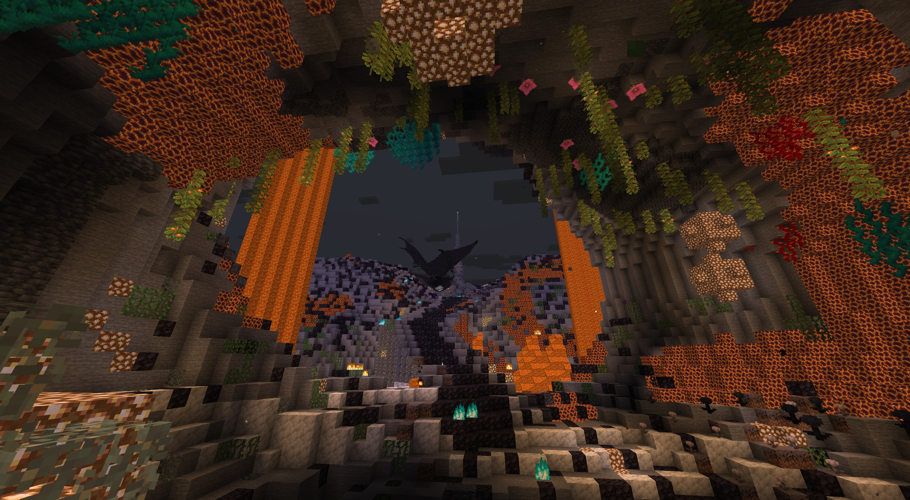
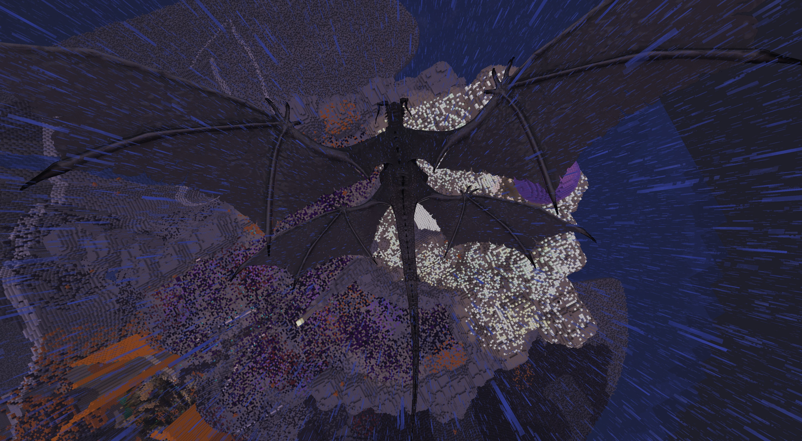

# Ancient Dragon

[Download](https://www.curseforge.com/minecraft/mc-mods/ancient-dragon/files) · [GitHub Releases](https://github.com/LIy-hub/AncientDragon/releases) · [中文](#中文)

A colossal dragon sleeps on a mountain far out at sea. Ancient Dragon adds this encounter to the Overworld: find the mountain, wake its guardian, and fight through the mountain, storm, and solar phases. There is one mountain and one dragon per world, and its defeat is permanent.

### Minecraft 26.3 source port

The `mc/26.3` branch builds Ancient Dragon `0.1.0-beta.1+26.3` with Fabric Loader 0.19.5,
Fabric API 0.161.0+26.3, Java 25 and **BlendLib 1.0.0-beta.3+26.3**.
See the [26.3 build instructions, changelog and evidence](docs/release/minecraft-26.3.md).
This source update does not create a GitHub Release or CurseForge upload.

`mc/26.3` 分支使用 Java 25、Loader 0.19.5、Fabric API 0.161.0+26.3 与 BlendLib Beta.3 的 26.3 专用包。
构建方法及验证边界见上述记录；未新增 GitHub Release 或 CurseForge 上传。

### Reaching the mountain

Explore the distant ocean, or take an Echo Shard to an Ancient City. Use it on the reinforced deepslate frame at the city's center to open a gateway. Every gateway leads to the same mountain.

The mountain generates in new chunks. An operator can find its selected location with `/ancientdragon structure locate`.

### Fighting the dragon

Combat moves between the sky and a ground platform. The dragon dives, sweeps its tail, and uses storm attacks and solar breath. Aim for the head to deal more damage, or attack the wings to reduce their stability and bring the dragon back to the platform. Health scales for groups of up to eight participants.

After the kill, use an axe on the corpse to collect materials. Eligible participants receive their shares of horns, scales, wing membrane, and bones; the player harvesting the corpse receives the single dragon heart. These materials lead into dragon equipment and Sunheart Altar upgrades. Four collectible chronicles accompany the encounter.

### Installation

**Current release: 0.1.0-beta.1.** Install Ancient Dragon, Fabric API, and [BlendLib 1.0.0-beta.2](https://www.curseforge.com/minecraft/mc-mods/blendlib) in the `mods` folder on both the server and every client. All three mods must match your Minecraft version. Fabric Loader 0.19.3 or newer is required.

| Minecraft | Java |
| --- | --- |
| 1.21.1–1.21.11 | 21 |
| 26.1, 26.1.1, 26.1.2, 26.2 | 25 |

Each Minecraft version has its own JAR. This is a beta release; back up an existing world before adding or updating the mod.

## 中文

一头巨龙沉睡在远海的神山上。Ancient Dragon 为主世界加入这场古龙战斗：找到神山，唤醒古龙，依次迎战群山、风暴与太阳阶段。每个世界只有一座神山和一只古龙，击败后不会再次刷新。

### 前往神山

可以直接探索远海，也可以带着回响碎片前往远古城市。对城市中央的强化深板岩框架使用回响碎片，即可打开通往神山的入口。不同城市的入口都会抵达同一座山。

神山只在尚未生成的区块中出现。管理员可用 `/ancientdragon structure locate` 查询位置。

### 战斗与奖励

战斗在空中与地面平台之间交替进行。古龙会俯冲、扫尾，并使用风暴攻击与太阳吐息。头部承受的伤害更高；持续攻击翅膀、打空翼部稳定性条，可以迫使古龙返回平台。生命值会按参战人数调整，最多计入八人。

击败后，对尸骸使用斧头即可采集材料。符合奖励条件的参战者各自获得龙角、鳞片、翼膜和龙骨，唯一的龙心归采集者所有。材料可用于制作古龙装备，并在日轮心坛继续升级。探索和战斗过程中还可以收集四本《余烬档案》。

### 安装

**当前版本：0.1.0-beta.1。** 将古龙、Fabric API 和 [BlendLib 1.0.0-beta.2](https://www.curseforge.com/minecraft/mc-mods/blendlib) 放入 `mods` 文件夹。客户端与服务端都要安装，三个模组须选择相同的 Minecraft 版本，并使用 Fabric Loader 0.19.3 或更高版本。

- Minecraft 1.21.1–1.21.11：Java 21。
- Minecraft 26.1、26.1.1、26.1.2、26.2：Java 25。
- 每个游戏版本使用各自的 JAR。当前仍为 Beta，加入或更新到已有世界前请先备份。

## Credits and license / 署名与许可

By **Liy**. The dragon model is adapted from Matt Alexander's *Realistic Minecraft Ender Dragon*, with textures adapted from Jazz Vincent's *Realistic Dragon Textures*.

Code: [MIT](LICENSE). Artwork and adapted assets: [CC BY 4.0](ASSET_LICENSE.md). See [THIRD_PARTY_NOTICES.md](THIRD_PARTY_NOTICES.md) for the original sources and attribution requirements.

作者：**Liy**。古龙模型改编自 Matt Alexander 的作品，纹理改编自 Jazz Vincent 的作品。代码采用 MIT，媒体与派生资产采用 CC BY 4.0；分发时请保留相应许可与署名，详见上述文件。

## Development / 开发

[Source branches, builds, and technical notes / 源码分支、构建与技术说明](docs/development.md)
